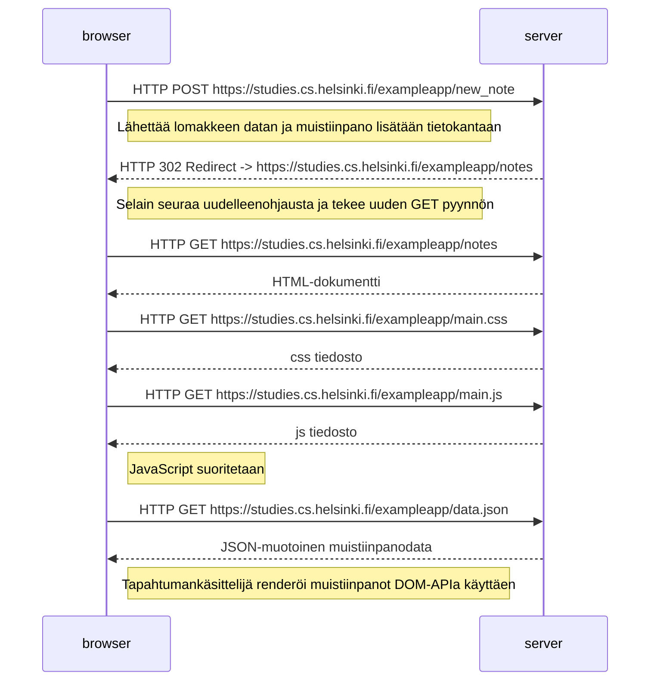

0.4: uusi muistiinpano

```mermaid
sequenceDiagram
    participant browser
    participant server

    browser->>server: HTTP POST https://studies.cs.helsinki.fi/exampleapp/new_note
    Note right of browser: Lähettää lomakkeen datan ja muistiinpano lisätään tietokantaan

    server-->>browser: HTTP 302 Redirect -> https://studies.cs.helsinki.fi/exampleapp/notes

    Note right of browser: Selain seuraa uudelleenohjausta ja tekee uuden GET pyynnön

    browser->>server: HTTP GET https://studies.cs.helsinki.fi/exampleapp/notes
    server-->>browser: HTML-dokumentti

    browser->>server: HTTP GET https://studies.cs.helsinki.fi/exampleapp/main.css
    server-->>browser: css tiedosto
    browser->>server: HTTP GET https://studies.cs.helsinki.fi/exampleapp/main.js
    server-->>browser: js tiedosto

    Note right of browser: JavaScript suoritetaan

    browser->>server: HTTP GET https://studies.cs.helsinki.fi/exampleapp/data.json
    server-->>browser: JSON-muotoinen muistiinpanodata

    Note right of browser: Tapahtumankäsittelijä renderöi muistiinpanot DOM-APIa käyttäen

```

