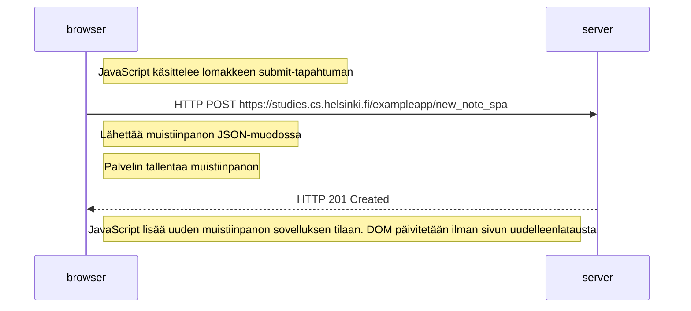

0.6: Uusi muistiinpano

```mermaid
sequenceDiagram 
    participant browser 
    participant server

    Note right of browser: JavaScript käsittelee lomakkeen submit-tapahtuman

    browser->>server: HTTP POST  https://studies.cs.helsinki.fi/exampleapp/new_note_spa
    Note right of browser:  Lähettää muistiinpanon JSON-muodossa

    Note right of browser: Palvelin tallentaa muistiinpanon
    server-->>browser: HTTP 201 Created 

    Note right of browser: JavaScript lisää uuden muistiinpanon sovelluksen tilaan. DOM päivitetään ilman sivun uudelleenlatausta
```
