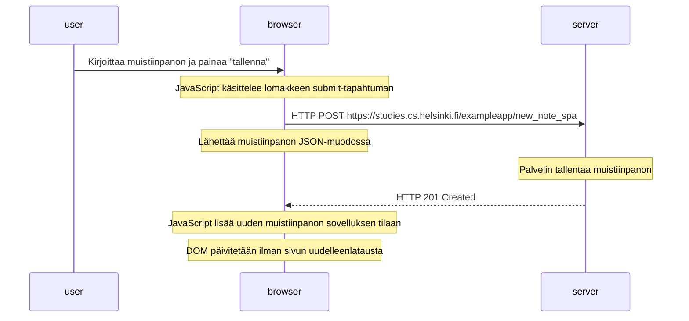

```mermaid
sequenceDiagram
    participant user 
    participant browser 
    participant server

    user->>browser: Kirjoittaa muistiinpanon ja painaa "tallenna"
    Note over browser: JavaScript käsittelee lomakkeen submit-tapahtuman

    browser->>server: HTTP POST  https://studies.cs.helsinki.fi/exampleapp/new_note_spa
    Note over browser:  Lähettää muistiinpanon JSON-muodossa

    Note over server: Palvelin tallentaa muistiinpanon
    server-->>browser: HTTP 201 Created 

    Note over browser: JavaScript lisää uuden muistiinpanon sovelluksen tilaan
    Note over browser: DOM päivitetään ilman sivun uudelleenlatausta
```
